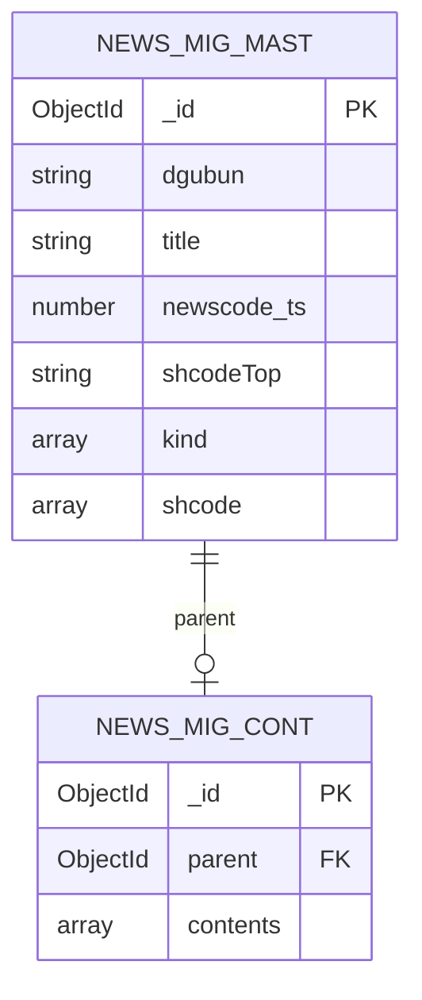

# News Data ERD

Oracle SQL 테이블을 MongoDB collection으로 로딩한 뒤, aggregation `$merge`로 조회용 target collection을 materialize하는 데이터 모델을 정리한다.

## Source: SQL to MongoDB 1:1 Mapping

초기 단계에서는 Oracle SQL table을 MongoDB collection으로 1:1 로딩한다.

```text
NEWS_MAST    -> news_mast
NEWS_JMCODE  -> news_jmcode
NEWS_CONT_P  -> news_cont_p
```

### 관계

| 관계 | 기준 |
|---|---|
| `NEWS_MAST.SEQNO` | PK 기준 |
| `NEWS_JMCODE.SEQNO` | `NEWS_MAST.SEQNO` 참조 |
| `NEWS_CONT_P.SEQNO` | `NEWS_MAST.SEQNO` 참조 |
| `NEWS_MAST : NEWS_JMCODE` | `1:N` |
| `NEWS_MAST : NEWS_CONT_P` | `1:N` |

### Source ERD

```mermaid
erDiagram
    NEWS_MAST ||--o{ NEWS_JMCODE : "SEQNO", "YMD", "NEWSCODE"
    NEWS_MAST ||--o{ NEWS_CONT_P : "SEQNO", "YMD", "NEWSCODE"

    NEWS_MAST {
        string DGUBUN
        string YMD
        string SEQNO
        string NEWSCODE
        string KIND
        string KIND2
        string TITLE
        string SHCODE
    }

    NEWS_JMCODE {
        string DGUBUN
        string YMD
        string SEQNO
        string SHCODE
        string EXPCODE
        string NEWSCODE
        string KIND
    }

    NEWS_CONT_P {
        string YMD
        string SEQNO
        string NEWSCODE
        number LINENO
        string CONTENT
    }
```

## Target: MongoDB Materialized Model

초기 collection 로딩 후 aggregation `$merge`를 사용해 신규 collection을 materialize한다.

```text
news_mast + news_jmcode + news_cont_p
-> aggregation / $lookup / $merge
-> news_mig
```

## Target Collection Pattern

애플리케이션 관점에서는 `newsMast`와 `newsCont`를 별도 entity로 나눠서 볼 수 있다.

분리 이유:

```text
뉴스 목록에서 사용자가 특정 뉴스를 선택하기 전까지는 본문(body)을 읽을 필요가 없음
```

하지만 실제 MongoDB collection은 독립 collection으로 분리하지 않고 single collection pattern을 권장한다.

권장 이유:

```text
1. Search index를 단일화할 수 있음
2. 애플리케이션 개발이 단순해짐
3. 목록/본문 조회 모델을 하나의 collection에서 관리 가능
```

## Target Document Shapes

### newsMast Document

뉴스 제목, 대표 종목, 종목 배열 등 목록 조회에 필요한 정보를 가진다.

```js
{
  _id: ObjectId("..."),
  dgubun: "P",
  title: "...",
  newscode_ts: 1798645844009,
  kind: ["P3", "030000"],
  shcodeTop: "005930",
  shcode: [
    {
      shcode: "005930",
      expcode: "A005930",
      kind: "P3"
    }
  ]
}
```

### newsCont Document

뉴스 본문을 별도 document shape으로 저장한다.

```js
{
  _id: ObjectId("..."),
  parent: ObjectId("..."),
  contents: [
    "본문 라인 1",
    "본문 라인 2",
    "본문 라인 3"
  ]
}
```

`parent`는 해당 본문의 원본 newsMast document `_id`를 참조한다.

## Target ERD



## Embedded jmcode Shape

`NEWS_JMCODE`의 `1:N` 관계는 target에서 embedded array로 materialize한다.

```js
jmcode {
  shcode,
  expcode,
  kind
}
```

MongoDB document 예시:

```js
shcode: [
  {
    shcode: "005930",
    expcode: "A005930",
    kind: "P3"
  },
  {
    shcode: "000660",
    expcode: "A000660",
    kind: "P3"
  }
]
```

## shcodeTop

`shcodeTop`은 `shcode[]` 값 중 하나로, 해당 뉴스의 대표 종목을 의미한다.

유지 이유:

```text
현재 애플리케이션이 사용하는 데이터 구조와의 호환성 유지
```

## Modeling Notes

| 항목 | 설명 |
|---|---|
| Source loading | Oracle table을 MongoDB collection으로 1:1 적재 |
| Materialization | `$lookup`, `$merge`로 target collection 생성 |
| JMCODE | `1:N` 관계를 embedded array로 변환 |
| CONTENT | `LINENO` 순서대로 배열화 |
| Target pattern | Single collection pattern 권장 |
| Search index | 단일 collection에 Search index 생성 가능 |

## Summary

초기 적재는 Oracle 테이블 구조를 그대로 MongoDB collection으로 가져온다.

그 다음 aggregation으로 `news_mig`를 materialize한다.

최종 모델은 애플리케이션의 목록 조회와 본문 조회 요구를 반영해 `newsMast`, `newsCont` 두 document shape을 하나의 collection 안에서 관리하는 구조다.
