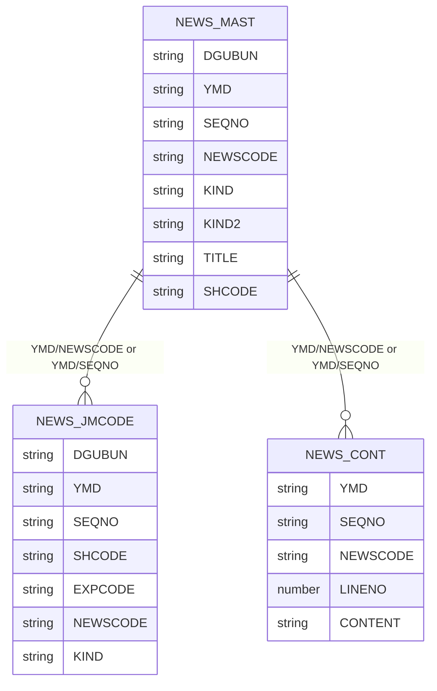
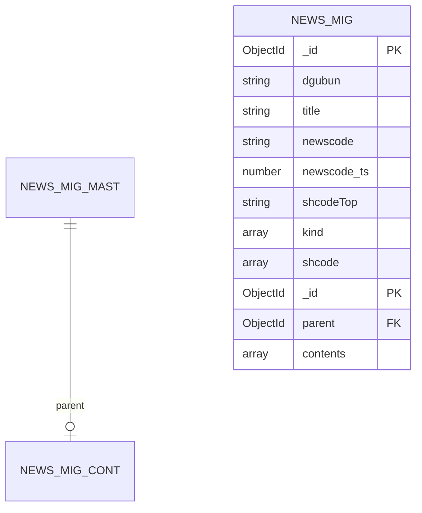

# MongoDB PoC 수행보고서

## 문서 목적

본 문서는 뉴스 검색 업무를 대상으로 Oracle 기반 조회와 MongoDB 기반 조회의 수행 결과를 비교하고, MongoDB 적용 시 데이터 모델링 및 검색 구조를 정리하기 위한 PoC 결과보고서다.

참고 문서:

```text
[미래에셋증권] MongoDB Pilot 수행보고서_20230911_최종본.pdf
260720_MongoDB_PoC 검증 시나리오_결과_오라클_포함_교보증권.xlsx
ERD.docx
```

## Agenda

I. MongoDB PoC 대상

II. MongoDB PoC 테스트 환경

III. MongoDB PoC 테스트 방법 및 기준

IV. 데이터 모델링

V. 테스트 수행 결과

VI. 종합 의견

## I. MongoDB PoC 대상

### 뉴스 검색 기능 검증

Oracle에 3개 테이블로 분리되어 있던 뉴스 데이터를 MongoDB로 이관하고, MongoDB Atlas Search를 사용해 뉴스 검색 시나리오를 검증했다.

검증 대상:

```text
뉴스 제목 검색
뉴스 본문 검색
뉴스구분 조건 검색
종목코드 조건 검색
Fuzzy 검색
Highlight 검색
```

### 주요 검증 항목

| 구분 | 검증 내용 |
|---|---|
| 데이터 모델링 | Oracle 3개 테이블을 MongoDB 조회 모델로 변환 |
| 검색 기능 | title, contents 대상 Atlas Search 검색 |
| 조건 검색 | 뉴스구분, 종목코드 조건 필터 |
| 성능 비교 | Oracle 기존 쿼리와 MongoDB MQL 수행시간 비교 |
| 부가 기능 | Fuzzy, Highlight 기능 검증 |

## II. MongoDB PoC 테스트 환경

### MongoDB 구성

| 항목 | 내용 |
|---|---|
| Database | `newsdb` |
| Source Collection | `news_mast`, `news_jmcode`, `news_cont_*` |
| Target Collection | `news_mig` |
| Search Index | `news_search_index` |
| 검색 방식 | MongoDB Atlas Search |

### 데이터 구조 특성

`news_mig`는 뉴스 제목과 본문이 split document 구조로 구성될 수 있다.

```text
title/shcode 문서
contents 문서
```

title 문서는 뉴스 제목, 뉴스구분, 종목코드 정보를 가진다.

contents 문서는 `parent` 필드로 title 문서를 참조하고, 본문 배열을 가진다.

## III. MongoDB PoC 테스트 방법 및 기준

### 테스트 기준

Oracle 기존 쿼리와 MongoDB MQL을 동일하거나 유사한 업무 조건으로 수행하고 응답시간을 비교했다.

성능 비교 대상은 1~8번 시나리오다.

9~12번은 MongoDB Search 부가 기능 검증으로 Oracle 비교 대상에서 제외했다.

### 비교 기준

| 항목 | 설명 |
|---|---|
| MongoDB 결과 | MQL 수행시간, 초 단위 |
| Oracle 결과 | 기존 Oracle 쿼리 수행시간, 초 단위 |
| MongoDB 감소율 | `(Oracle - MongoDB) / Oracle * 100` |
| Oracle 추가 소요율 | `(Oracle - MongoDB) / MongoDB * 100` |

시나리오 1은 Oracle 결과가 timeout으로 기록되어 정량 비교율 산정에서 제외했다.

## IV. 데이터 모델링

### Source: Oracle Table 구조

Oracle 원천 데이터는 3개 테이블로 구성된다.

```text
NEWS_MAST
NEWS_JMCODE
NEWS_CONT_P / NEWS_CONT_* 계열
```

관계:

| 관계 | 설명 |
|---|---|
| `NEWS_MAST : NEWS_JMCODE` | 1:N, 뉴스별 종목 매핑 |
| `NEWS_MAST : NEWS_CONT_*` | 1:N, 뉴스별 본문 라인 |
| `NEWS_CONT_*.LINENO` | 본문 라인 순서 |

### Source ERD



### MongoDB Target Model

Oracle table을 MongoDB collection으로 1:1 적재한 뒤 aggregation으로 조회용 collection을 materialize한다.

```text
news_mast + news_jmcode + news_cont_*
-> aggregation / $lookup / $merge
-> news_mig
```

### Target Document Shape: title 문서

```js
{
  _id: ObjectId("..."),
  dgubun: "P",
  title: "...",
  newscode: "2026070812345678",
  newscode_ts: 1798645844009,
  kind: ["P3", "030000"],
  shcodeTop: "005930",
  shcode: [
    {
      shcode: "005930",
      expcode: "A005930"
    }
  ]
}
```

### Target Document Shape: contents 문서

```js
{
  _id: ObjectId("..."),
  parent: ObjectId("..."),
  contents: [
    "본문 라인 1",
    "본문 라인 2",
    "본문 라인 3"
  ]
}
```

### Target ERD



### 모델링 고려사항

| 항목 | 내용 |
|---|---|
| JMCODE | `shcode`, `expcode`를 embedded array로 구성 |
| CONTENT | `LINENO` 순서대로 `contents` 배열 구성 |
| 본문 분리 | 목록 조회 시 본문을 읽지 않도록 title 문서와 contents 문서 분리 가능 |
| Search Index | 단일 target collection 기준으로 Search Index 구성 |
| Join 우선순위 | `YMD + NEWSCODE` 우선, 없으면 `YMD + SEQNO` fallback |

## V. 테스트 수행 결과

## 1. 시나리오별 수행시간 비교

### 시나리오별 결과 표

| 시나리오 | 검증 내용 | MongoDB | Oracle | MongoDB 감소율 | Oracle 추가 소요율 |
|---:|---|---:|---:|---:|---:|
| 1 | 검색어 결과 없음 | 0.02초 | Timeout | 비교 제외 | 비교 제외 |
| 2 | 뉴스구분 조건 조회 | 0.03초 | 0.04초 | 25.0% 빠름 | Oracle 33.3% 더 소요 |
| 3 | 종목코드 + 검색어 | 0.02초 | 0.11초 | 81.8% 빠름 | Oracle 450.0% 더 소요 |
| 4 | 뉴스구분 + 검색어 | 0.01초 | 0.12초 | 91.7% 빠름 | Oracle 1100.0% 더 소요 |
| 5 | 종목코드 조건 조회 | 0.01초 | 0.09초 | 88.9% 빠름 | Oracle 800.0% 더 소요 |
| 6 | 종목코드 + 뉴스구분 | 0.02초 | 0.10초 | 80.0% 빠름 | Oracle 400.0% 더 소요 |
| 7 | 전체 title 검색 | 0.02초 | 0.07초 | 71.4% 빠름 | Oracle 250.0% 더 소요 |
| 8 | 뉴스구분 + title 검색 | 0.03초 | 0.11초 | 72.7% 빠름 | Oracle 266.7% 더 소요 |

### 수행시간 비교 그래프


### 성능 요약

정량 비교가 가능한 2~8번 시나리오 기준 MongoDB는 Oracle 대비 전 구간에서 더 낮은 응답시간을 보였다.

```text
MongoDB 평균: 0.020초
Oracle 평균: 0.091초
평균 감소율: 약 78.1%
```

시나리오 1은 Oracle이 timeout으로 기록되어 정량 비교에서 제외했다.

## 2. 부가 검색 기능 결과

| 시나리오 | 검증 내용 | MongoDB 결과 | Oracle 비교 |
|---:|---|---:|---|
| 9 | Fuzzy 검색 | 0.03초 | 해당 없음 |
| 10 | Highlight 검색 | 0.04초 | 해당 없음 |
| 11 | title 또는 contents 검색 | 0.02초 | 해당 없음 |
| 12 | contents 전용 검색 | 0.01초 | 해당 없음 |

## 3. 주요 관찰 사항

### MongoDB Search 성능

뉴스 검색 주요 시나리오에서 MongoDB는 Oracle 대비 빠른 응답시간을 보였다.

특히 종목코드와 검색어를 함께 사용하는 조건 검색에서 Oracle 대비 응답시간 감소폭이 크게 나타났다.

### Split Document 구조 영향

`news_mig`는 title 문서와 contents 문서가 분리되어 있어, `title`과 `contents`를 동시에 검색하는 경우 결과 문서 형태가 다를 수 있다.

```text
title 매칭 결과    : title, dgubun, shcode 포함
contents 매칭 결과 : parent, contents 포함
```

이 구조는 목록 조회와 본문 조회를 분리하는 장점이 있으나, title과 contents를 하나의 문서처럼 결합해 검색해야 하는 경우에는 `$lookup` 또는 unified target 모델을 검토해야 한다.

### Oracle 대비 차이

Oracle은 기존 테이블 간 join과 `INSTRB` 기반 검색을 사용한다.

MongoDB는 Atlas Search index 기반으로 검색 조건을 처리한다.

따라서 검색어 조건이 포함된 시나리오에서 MongoDB의 응답시간이 더 낮게 측정되었다.

## VI. 종합 의견

### 결과 요약

MongoDB 기반 뉴스 검색 PoC는 주요 성능 비교 시나리오에서 Oracle 대비 우수한 응답시간을 보였다.

정량 비교가 가능한 2~8번 시나리오에서는 MongoDB가 모두 더 빠른 결과를 보였으며, 평균 기준 약 78.1%의 응답시간 감소를 확인했다.

### 적용 가능성

MongoDB Atlas Search는 뉴스 제목, 본문, 종목코드, 뉴스구분 조건을 조합한 검색 업무에 적합하다.

특히 다음 요구에 효과적이다.

```text
키워드 기반 뉴스 검색
종목코드 기반 필터링
뉴스구분 기반 필터링
Fuzzy 검색
Highlight 검색
```

### 보완 필요 사항

| 항목 | 보완 내용 |
|---|---|
| 데이터 모델 | title/contents split 구조와 unified 구조 중 업무 UX에 맞는 최종 선택 필요 |
| Search Index | 운영 데이터 구조에 맞춘 mapping 확정 필요 |
| Migration | `YMD + NEWSCODE`, fallback `YMD + SEQNO` 기준 정합성 검증 필요 |
| 운영 검증 | 대량 데이터, 장시간 검색, 장애 상황 테스트 추가 필요 |
| 모니터링 | 검색 latency, index build time, resource usage 모니터링 필요 |

### 최종 의견

MongoDB는 뉴스 검색 PoC 범위에서 기존 Oracle 대비 빠른 검색 성능을 보였고, Atlas Search 기반 부가 검색 기능도 적용 가능함을 확인했다.

향후 운영 적용을 위해서는 최종 데이터 모델을 확정하고, 실제 운영 데이터 규모에서 index build 및 query latency를 추가 검증하는 것을 권장한다.
